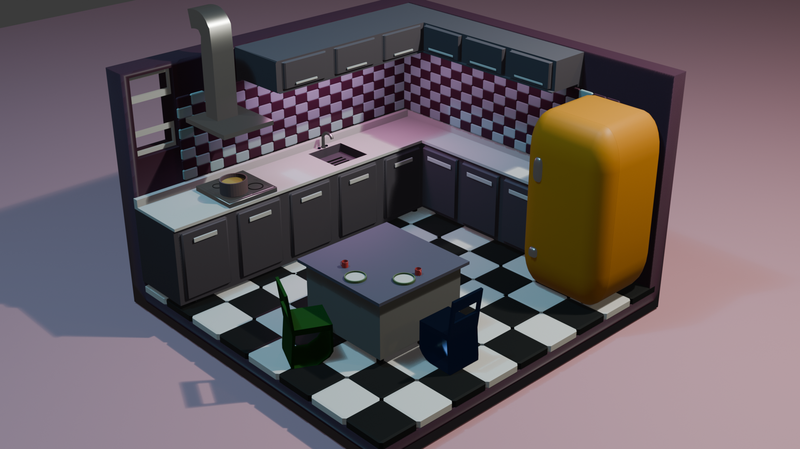
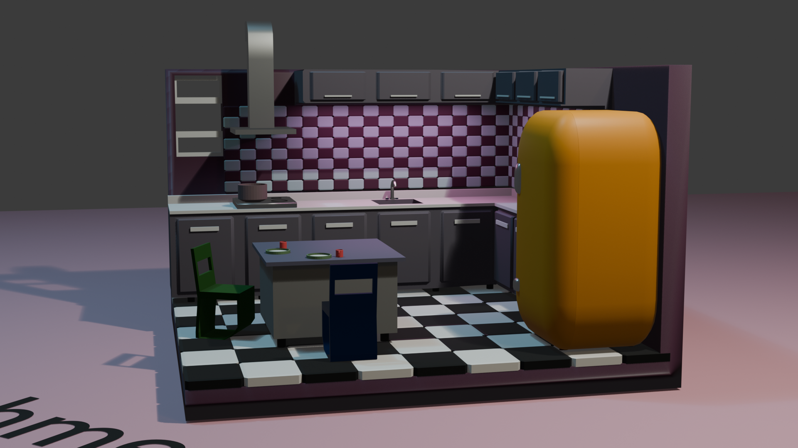
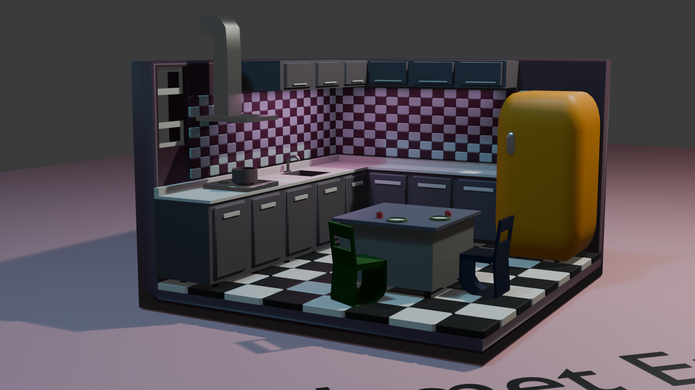
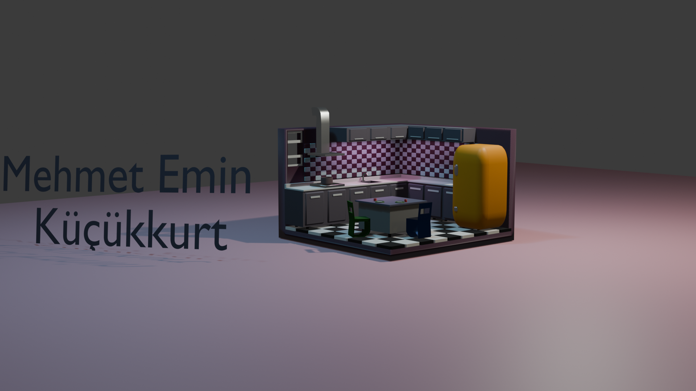

# 🪑🌿 Blender Modellerim

Bu repo, Blender kullanarak yaptığım **ilk 3D model çalışmalarımı** içerir.  
Üç farklı model bulunmaktadır:

1. **Koltuk Modeli** → Koltuk, minder ve yastık detaylarıyla birlikte  
2. **Çimen ve Kaya Modeli** → Üzerinde kaya bulunan çimen yüzeyi  
3. **Mutfak Modeli** → Mutfak dolapları, tezgâh ve detaylı mutfak sahnesi  

Bu çalışmalar, Blender öğrenme sürecimin ilk adımlarıdır.

---

## 📌 Model 1: Koltuk
- **İçerik:** Koltuk + minder + yastık
- **Format:** `.blend`
- **Amaç:** Temel modelleme ve obje detaylandırma pratiği

### 📷 Önizleme

---

## 📌 Model 2: Çimen ve Kaya
- **İçerik:** Çimen yüzeyi + kaya
- **Format:** `.blend`
- **Amaç:** Doğal yüzey ve obje konumlandırma pratiği

### 📷 Önizleme

---

## 📌 Model 3: Mutfak
- **İçerik:** Mutfak dolapları, tezgâh ve detaylı mutfak sahnesi
- **Format:** `.blend`
- **Amaç:** İç mekân düzenleme, ışıklandırma ve detaylı modelleme pratiği

### 📷 Önizleme

---

## 📂 Dosya Listesi
- `Koltuk.blend` → Koltuk modeli  
- `Grass&Rock.blend` → Çimen ve kaya modeli  
- `Kitchen.blend` → Mutfak modeli  
- `Koltuk.png`, `Koltuk2.png` → Koltuk renderları  
- `Grass&Rock.png` → Çimen ve kaya renderı  
- `mutfak1.png`, `mutfak2.png`, `mutfak3.png`, `mutfak4.png` → Mutfak renderları  
- `README.md` → Proje hakkında bilgiler  

---

## ✨ Notlar
Bu projeler tamamen öğrenme ve portfolyo geliştirme amaçlıdır.  
Blender’da modelleme, materyal ekleme ve sahne düzenleme tekniklerimi geliştirmek için yapılmıştır.
